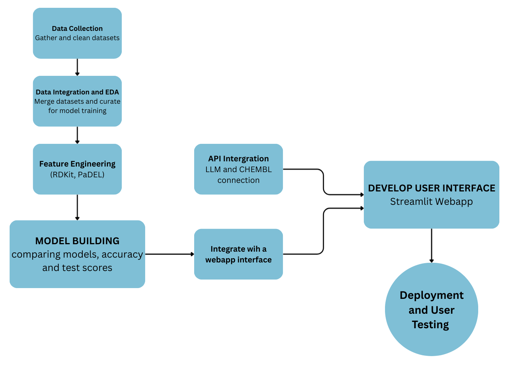

# mtoralzml


[](https://opensource.org/licenses/MIT)
[](https://GitHub.com/yourusername/mtoralzml/graphs/contributors/)
[](https://github.com/yourusername/mtoralzml/tags/)

**mtoralzml** is an open-source computational pipeline for predicting blood-brain barrier (BBB) permeability of mTOR inhibitors, with a focus on Alzheimer’s disease drug discovery. The project integrates cheminformatics and machine learning to streamline candidate selection and accelerate CNS drug development.

---

## Overview

Predicting Blood-Brain Barrier-Permeable mTOR Inhibitors for Alzheimer’s Disease Using Machine Learning

The blood–brain barrier (BBB) is a highly selective physiological interface that regulates the transport of molecules between the bloodstream and the central nervous system (CNS). BBB permeability
is a decisive factor in determining whether a therapeutic compound can reach its CNS target. Many potential drug candidates fail late in development due to inadequate BBB penetration, causing
substantial financial and time losses.

Predicting BBB permeability early in the drug discovery process can streamline candidate selection, reduce attrition rates, and focus experimental resources on the most promising molecules. While
existing computational tools exist, many lack transparency, reproducibility, or the ability to handle domain-specific datasets.

This project proposes NeuroGate, an open-source, reproducible computational platform for predicting BBB permeability. The platform is designed to be general-purpose—capable of evaluating molecules
across a variety of therapeutic areas—but will demonstrate its capabilities through case studies in neurodegenerative disease drug discovery, such as Alzheimer’s disease (AD), where BBB penetration
is crucial for targeting the mTOR pathway and other CNS-relevant mechanisms.

---

## Table of Contents

- [Objectives](#objectives)
- [Workflow](#workflow)
- [Getting Started](#getting-started)
- [Data Sources](#data-sources)
- [Descriptor Calculation](#descriptor-calculation)
- [Modeling & Analysis](#modeling--analysis)
- [Results](#results)
- [Reproducibility](#reproducibility)
- [Contributing](#contributing)
- [License](#license)
- [Citation](#citation)

---

## Objectives

- [x] Data Integration – Aggregate and harmonize high-quality BBB permeability datasets from multiple public sources.
- [x] Calculate molecular descriptors (RDKit, Mordred)
- [x] Integrate BBB permeability data
- [x] Model Development – Build multiple machine learning architectures for BBB classification, from traditional QSAR approaches to deep learning methods.
- [x] Evaluate machine learning models for BBB prediction
- [x] Uncertainty Quantification – Incorporate prediction confidence and applicability domain detection for safer decision-making.
- [x] Interpretability – Provide mechanistic insights into which molecular features drive BBB penetration predictions.
- [x] Build platform (Web application) to predict BBB permeability
- [x] Platform Deployment – Create a publicly accessible web interface and API for molecule evaluation.
- [x] Domain Demonstration – Apply the platform to mTOR inhibitors and other Alzheimer’s-related compounds as a real-world neurodegenerative disease use case.

---

## Workflow

.

---

## Getting Started

1. **Clone the repository**

   ```bash
   git clone https://github.com/yourusername/mtoralzml.git
   cd mtoralzml
   ```

2. **Install dependencies**

   ```bash
   pip install -r requirements.txt
   ```

3. **Run descriptor calculation scripts**

   ```bash
   python scripts/extract_smiles.py
   python scripts/RDKIT_descriptors.py
   python scripts/mordred_descr_cal.py
   python scripts/PADEL_descriptor_cal.py
   ```

4. **Explore and analyze data**
   - Use the Jupyter notebooks in `notebooks/` for data curation and model building.

---

## Data Sources

### Core BBB Permeability data

- MoleculeNet BBBp (2,059 compounds, BBB+/– labels)
- PubChem BioAssays (AID 628 and related BBB assays)
- DrugBank CNS/non-CNS drug lists
- Literature datasets of brain/plasma ratios for known drugs

### Domain-Specific Case Study Data

- ChEMBL bioactivity datasets for mTOR inhibitors (Target CHEMBL2842)
- BindingDB mTOR ligand binding affinities
- Alzheimer’s-related small molecule datasets from AD Knowledge Portal and PubChem

---
