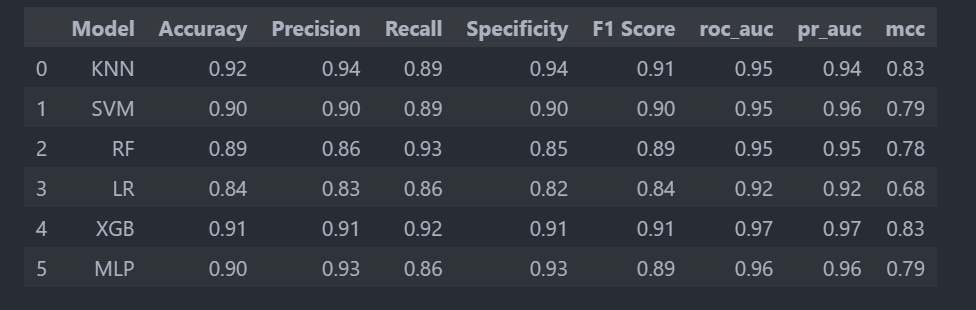
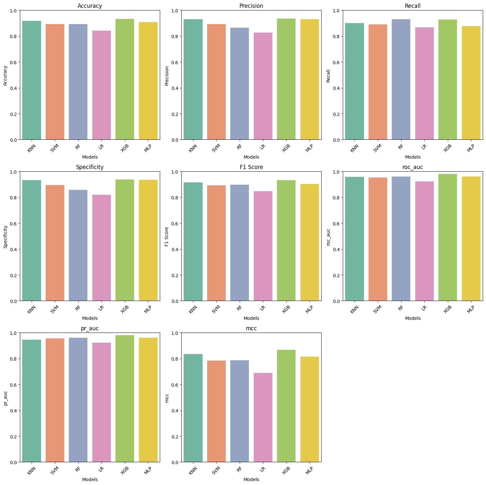
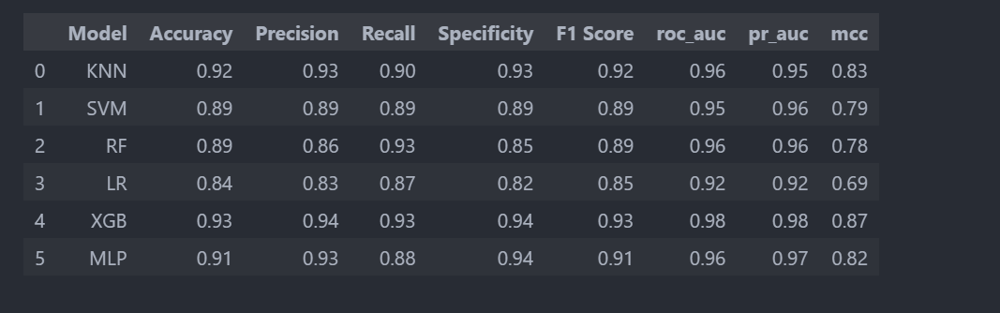
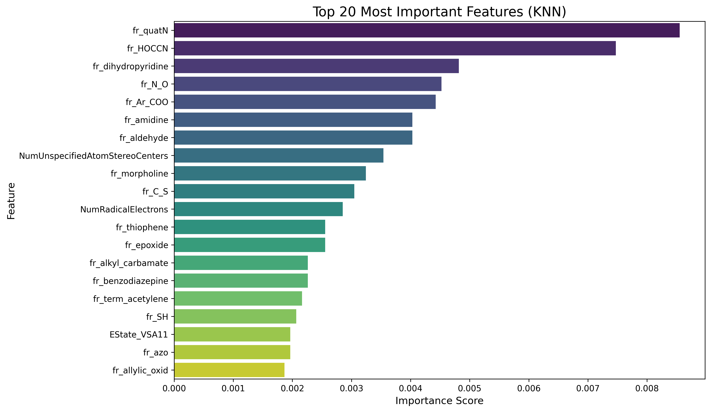
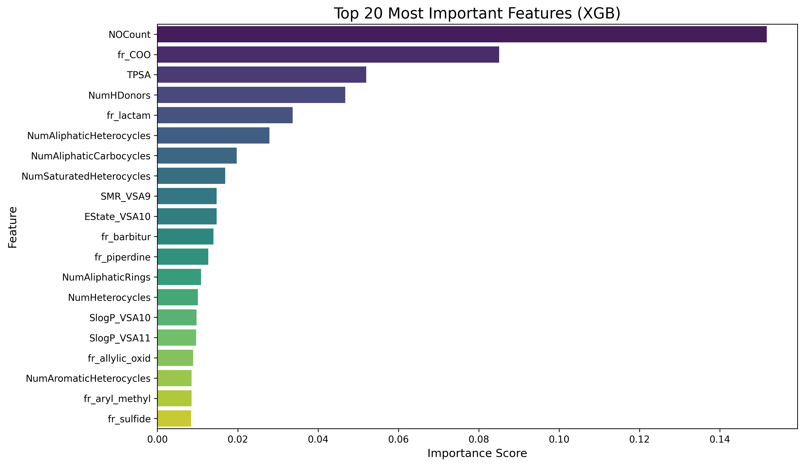

# 🧠 BrainRoute

<div align="center">


**An Open Machine Learning Platform for Blood–Brain Barrier Permeability Prediction with Neurodegenerative Disease Applications.**
**This project serves as a resource for advancing research in central nervous system (CNS) therapeutics and supporting the development of novel treatment strategies.**


[](https://www.python.org/downloads/)
[](https://opensource.org/licenses/MIT)
[](https://streamlit.io)
[](https://github.com/omicscodeathon/mtoralzml)
[](https://GitHub.com/omicscodeathon/mtoralzml/graphs/contributors/)
[](https://doi.org/10.1101/2025.xxx)

[🚀 Live Demo](https://huggingface.co/spaces/Nnobody/brainroute) • [📖 Documentation](#-table-of-contents) • [💬 Discussions](https://github.com/omicscodeathon/mtoralzml/discussions) • [🐛 Report Bug](https://github.com/omicscodeathon/mtoralzml/issues)

</div>

---

## 📋 Table of Contents

- [Overview](#-overview)
- [Key Features](#-key-features)
- [Scientific Background](#-scientific-background)
- [Installation](#-installation)
- [Quick Start](#-quick-start)
- [Workflow](#-workflow)
- [Models & Performance](#-models--performance)
- [Platform Features](#-platform-features)
- [Case Study: mTOR Inhibitors](#-case-study-mtor-inhibitors)
- [Results & Benchmarking](#-results--benchmarking)
- [API Reference](#-api-reference)
- [Troubleshooting](#-troubleshooting)
- [Contributing](#-contributing)
- [Citation](#-citation)
- [Acknowledgments](#-acknowledgments)
- [License](#-license)

---

## 🎯 Overview

**BrainRoute** (also referred to as **NeuroGate** in the web interface) is an open-source, AI-powered computational platform designed to predict blood-brain barrier (BBB) permeability of small molecules, addressing one of the most critical challenges in central nervous system (CNS) drug discovery.

The blood-brain barrier acts as a highly selective physiological interface that restricts ~98% of small molecules and nearly all large molecules from entering the brain. This creates a significant bottleneck in developing therapeutics for neurodegenerative diseases, CNS infections, brain tumors, and other neurological conditions.

### Why BrainRoute?

- 🎯 **High Accuracy**: KNN model achieves **92% F1-score**, outperforming many deep learning approaches
- 🔬 **Uncertainty Quantification**: Ensemble-based confidence scoring for reliable predictions
- 🤖 **AI-Augmented Insights**: Integrated Llama 3 LLM for contextual molecular information
- 📊 **Batch Processing**: Analyze hundreds of compounds simultaneously
- 🌐 **User-Friendly Interface**: No coding required - accessible via web browser
- 📖 **Open Science**: Fully reproducible with curated datasets and transparent methods
- 💊 **Clinically Relevant**: Applied to real-world case studies (mTOR inhibitors, Alzheimer's disease)

---

## ✨ Key Features

### 🔮 Predictive Modeling

- **Multiple ML Algorithms**: KNN, XGBoost, SVM, Random Forest, Logistic Regression
- **Deep Learning**: BERT-based SMILES encoder with transfer learning
- **Ensemble Predictions**: Combines multiple models for robust outputs
- **Uncertainty Estimation**: Model agreement metrics and confidence intervals

### 💻 Interactive Platform

- **Single Molecule Analysis**: Input by compound name or SMILES string
- **Batch Processing**: Upload CSV files with multiple compounds
- **Real-time Predictions**: Fast inference with pre-trained models
- **Molecular Visualization**: 2D structure rendering with RDKit
- **Property Calculation**: Automatic computation of MW, LogP, TPSA, HBA/HBD

### 🤖 AI-Powered Knowledge Discovery

- **LLM Integration**: Chat with Llama 3 about your molecules
- **Contextual Insights**: Get mechanism of action, drug potential, side effects
- **Literature Integration**: Links to PubMed, ChEMBL, and PubChem
- **Export Capabilities**: Download predictions and chat histories

### 🗄️ Curated Database

- **React-based Interface**: Interactive molecular database browser
- **9,857+ Molecules**: Annotated with BBB permeability data
- **Real-time Structure Rendering**: Client-side RDKit.js integration
- **Search & Filter**: Find molecules by properties or predictions

---

## 🧬 Scientific Background

### The BBB Challenge in CNS Drug Discovery

The blood-brain barrier (BBB) is formed by specialized brain microvascular endothelial cells connected by tight junctions, supported by pericytes and astrocytes. It serves as a critical neuroprotective mechanism but simultaneously represents the most significant obstacle in CNS therapeutics development.

**Key Statistics:**

- ~98% of small molecule drugs cannot cross the BBB
- Nearly 100% of large molecule biologics are excluded
- BBB penetration failure is a leading cause of late-stage drug development attrition
- Estimated cost: $2-3 billion per failed CNS drug candidate

### Current Approaches & Limitations

Traditional BBB prediction methods rely on:

1. **Physicochemical heuristics** (Lipinski's rules, polar surface area)
2. **In vitro assays** (PAMPA-BBB, MDCK-MDR1)
3. **In vivo methods** (brain/plasma ratio, microdialysis)

**Limitations:**

- Resource-intensive and time-consuming
- Low throughput for early-stage screening
- High inter-assay variability
- Limited predictive accuracy for novel scaffolds
- Expensive (~$10,000-50,000 per compound tested)

### BrainRoute's Innovation

BrainRoute addresses these limitations by:

- Leveraging heterogeneous datasets (B3DB, MoleculeNet) for robust training
- Implementing uncertainty-aware predictions with ensemble methods
- Providing interpretable features and molecular property analysis
- Offering open-source, reproducible workflows
- Integrating LLM for knowledge augmentation and mechanism exploration

**Clinical Relevance:**
Applied to neurodegenerative diseases (Alzheimer's, Parkinson's), neuro-oncology, infectious diseases (meningitis, encephalitis), and toxicology assessment.

---

## 🚀 Installation

### Prerequisites

- Python 3.8+ (3.12 recommended)
- pip or conda package manager
- 8GB RAM minimum (16GB recommended for batch processing)
- Modern web browser (Chrome, Firefox, Safari, Edge)

### Option 1: Standard Installation (Intel/AMD)

```bash
# Clone the repository
git clone https://github.com/omicscodeathon/mtoralzml.git
cd mtoralzml

# Create virtual environment (recommended)
python -m venv brainroute_env
source brainroute_env/bin/activate  # On Windows: brainroute_env\Scripts\activate

# Install dependencies
pip install -r requirements.txt
```

### Option 2: Apple Silicon (M1/M2/M3)

```bash
# Clone and navigate
git clone https://github.com/omicscodeathon/mtoralzml.git
cd mtoralzml

# Create conda environment (recommended for M-series chips)
conda create -n brainroute python=3.12
conda activate brainroute

# Install dependencies
pip install -r requirements_macos.txt
```

### Option 3: Docker Installation

```bash
# Pull the Docker image
docker pull ghcr.io/omicscodeathon/brainroute:latest

# Run the container
docker run -p 8501:8501 ghcr.io/omicscodeathon/brainroute:latest
```

### Verify Installation

```bash
# Test imports
python -c "import rdkit; import streamlit; import sklearn; print('✓ Installation successful!')"

# Run tests
pytest tests/
```

---

## ⚡ Quick Start

### Launch the Web Application

```bash
# Navigate to project directory
cd mtoralzml

# Start Streamlit app
streamlit run scripts/webapp/main.py
```

The application will open automatically in your browser at `http://localhost:8501`

### Command-Line Prediction (Python API)

```python
from rdkit import Chem
from scripts.webapp.prediction import predict_bbb_penetration_with_uncertainty
from scripts.webapp.utils import load_ml_models

# Load models
models, _ = load_ml_models()

# Predict BBB permeability
smiles = "CC(=O)OC1=CC=CC=C1C(=O)O"  # Aspirin
mol = Chem.MolFromSmiles(smiles)

result, error = predict_bbb_penetration_with_uncertainty(mol, models)

print(f"Prediction: {result['prediction']}")
print(f"Confidence: {result['confidence']:.2f}%")
print(f"Uncertainty: {result['uncertainty']:.2f}%")
print(f"Model Agreement: {result['agreement']:.2f}%")
```

### Batch Processing Example

```python
import pandas as pd

# Prepare data
molecules = pd.DataFrame({
    'name': ['Aspirin', 'Caffeine', 'Donepezil'],
    'smiles': ['CC(=O)OC1=CC=CC=C1C(=O)O',
               'CN1C=NC2=C1C(=O)N(C(=O)N2C)C',
               'COc1ccc2c(c1)C(=O)c1ccccc1N2']
})

# Save to CSV
molecules.to_csv('molecules_to_predict.csv', index=False)

# Upload via web interface or use batch API
from scripts.webapp.prediction import process_batch_molecules
results, error = process_batch_molecules(molecules, 'csv', models)
```

---

## 🔬 Workflow


### 1️⃣ Data Collection & Curation

**Data Sources:**

- [B3DB](https://github.com/theochem/B3DB) - 7,807 molecules with experimental BBB data
- [MoleculeNet BBBP](https://moleculenet.org/datasets-1) - 2,059 binary classifications
- Additional curated datasets from literature

**Initial Dataset:**

- **Total molecules**: 9,857
- **BBB+** (permeable): 6,523 (66.2%)
- **BBB-** (non-permeable): 3,334 (33.8%)
- **Representation**: SMILES strings

### 2️⃣ Molecular Descriptor Calculation

- Molecular descriptors of the [molecules](data/B3BD/smiles.smi) were calculated using [RDKIT](https://www.rdkit.org/docs/GettingStartedInPython.html) version 25.03.6.
- The descriptors were calculated using the ['RDKIT_descriptors'](scripts/RDKIT_descriptors.py) python script.

```bash
# Extract SMILES from source files
python scripts/extract_smiles.py

# Calculate RDKit descriptors (217 features)
python scripts/RDKIT_descriptors.py

```

**Descriptors Computed (RDKit - 217 features):**

- Physicochemical: MW, LogP, MR, TPSA
- Topological: Balaban J, Bertz CT, Chi indices
- Electronic: Partial charges, atom type counts
- Structural: Ring counts, H-bond donors/acceptors
- Lipinski's descriptors: Rule of 5 compliance
- Graph-based: Molecular connectivity indices

### 3️⃣ Data Preprocessing

**Quality Control:**

- Duplicate smiles were removed
- Entries with completely missing descriptors were dropped

```python
# Remove duplicates
df = df.drop_duplicates(subset=['smiles'])

# Handle missing values
df = df.dropna(thresh=len(df.columns) * 0.5)  # Drop if >50% missing
df = df.fillna(0)  # Fill remaining with 0

```

**Normalization:**

- Data was standardized to have zero mean and unit standard deviation using [StandardScaler()](https://scikit-learn.org/stable/modules/generated/sklearn.preprocessing.StandardScaler.html) to enable models converge quickly.

```python
from sklearn.preprocessing import StandardScaler

scaler = StandardScaler()
X_scaled = scaler.fit_transform(X)
# μ = 0, σ = 1 for all features
```

**Class Balancing:**

- Balanced out BBB+ and BBB- classes in data by generating synthetic data for BBB minority class using [SMOTE](https://imbalanced-learn.org/stable/references/generated/imblearn.over_sampling.SMOTE.html)

```python
from imblearn.over_sampling import SMOTE

smote = SMOTE(random_state=42, k_neighbors=5)
X_resampled, y_resampled = smote.fit_resample(X_scaled, y)
```

**Final Dataset:**

- **Total samples**: 12,716 (after SMOTE)
- **BBB+**: 6,358 (50%)
- **BBB-**: 6,358 (50%)
- **Features**: 217 (RDKit descriptors)
- **Train/Test split**: 80/20 (10,172 / 2,544)

### 4️⃣ Model Development & Training

#### A. Classical Machine Learning

**Model Selection Strategy:**

1. **Initial Screening**: [LazyPredict](https://pypi.org/project/lazypredict/) for rapid benchmarking
2. **Hyperparameter Tuning**: GridSearchCV with 5-fold CV
3. **Final Evaluation**: [Stratified](https://scikit-learn.org/stable/modules/generated/sklearn.model_selection.StratifiedKFold.html) test set

**Models Implemented:**

| Model             | Algorithm              | Key Parameters                     | Training Time |
| ----------------- | ---------------------- | ---------------------------------- | ------------- |
| **KNN**           | K-Nearest Neighbors    | k=3, weights='distance'            | ~5 min        |
| **XGBoost**       | Gradient Boosting      | n_estimators=100, max_depth=6      | ~15 min       |
| **SVM**           | Support Vector Machine | kernel='rbf', C=1.0, gamma='scale' | ~30 min       |
| **Random Forest** | Ensemble (Bagging)     | n_estimators=100, max_depth=8      | ~20 min       |
| **Logistic Reg**  | Linear Classifier      | max_iter=1000, solver='lbfgs'      | ~2 min        |

**Training Code:**

```python
from sklearn.neighbors import KNeighborsClassifier
from sklearn.model_selection import StratifiedKFold, cross_val_score
import joblib

# Initialize model
knn = KNeighborsClassifier(n_neighbors=3, weights='distance')

# Cross-validation
skf = StratifiedKFold(n_splits=5, shuffle=True, random_state=42)
cv_scores = cross_val_score(knn, X_train, y_train, cv=skf, scoring='f1')

# Train final model
knn.fit(X_train, y_train)

# Save model
joblib.dump(knn, 'output/models/KNN_model.pkl')
```

#### B. Deep Learning Approach

**Architecture**: SPMM (Structure-Property Multi-Modal) Model

- **Base**: BERT (Bidirectional Encoder Representations from Transformers)
- **Input**: SMILES tokenization
- **Pre-training**: 10M+ molecules from PubChem
- **Fine-tuning**: BBB-specific dataset

**Model Architecture:**

```
Input (SMILES) → Tokenizer → BERT Encoder → [CLS] Token
                                                ↓
                                    Linear(768 → 256) + GELU
                                                ↓
                                    Dropout(0.1)
                                                ↓
                                    Linear(256 → 2)
                                                ↓
                                    Softmax → [BBB+, BBB-]
```

**Training Configuration:**

```python
from torch.optim import AdamW
from torch.optim.lr_scheduler import CosineAnnealingLR
from torch.nn import CrossEntropyLoss

optimizer = AdamW(model.parameters(), lr=3e-5, weight_decay=0.02)
scheduler = CosineAnnealingLR(optimizer, T_max=10)
loss_fn = CrossEntropyLoss()

# Training hyperparameters
batch_size_train = 16
batch_size_eval = 64
num_epochs = 10
warmup_epochs = 1
```

### 5️⃣ Platform Development

**Technology Stack:**

- **Frontend**: [Streamlit](<[reference](https://streamlit.io/)>) + Custom CSS
- **Backend**: Python 3.12
- **ML Framework**: scikit-learn, XGBoost, PyTorch
- **Cheminformatics**: RDKit 2025.03.6
- **LLM**: Llama 3 8B (via Hugging Face Inference API)
- **Database**: React + Google Sheets API + RDKit.js
- **Deployment**: Hugging Face Spaces

**API Integrations:**

1. **[ChEMBL API](https://www.ebi.ac.uk/chembl/)**: Drug information, bioactivity data
2. **[PubChem PUG REST API](https://pubchem.ncbi.nlm.nih.gov/docs/pug-rest)**: Chemical properties, synonyms
3. **Hugging Face Router**: LLM inference
4. **Google Sheets API**: Collaborative database backend

---

## 📊 Models & Performance

### Evaluation Metrics

**Cross-Validation (5-fold Stratified):**





**External Test Set (Held-out 20%):**



### Feature Importance

**Top 2 performing models (KNN and XGBoost)**




### Comparison with Literature

| Study                    | Year     | Best Model      | Accuracy/F1                                | Dataset Size |
| ------------------------ | -------- | --------------- | ------------------------------------------ | ------------ |
| **BrainRoute (Ours)**    | **2025** | **XGB**         | **Acc: 0.93**, **F1: 0.93**, **AUC: 0.98** | **12,716**   |
| **BrainRoute (Ours)**    | **2025** | **KNN**         | **Acc: 0.92**, **F1: 0.92**, **AUC: 0.96** | **12,716**   |
| Wang et al.              | 2018     | SVM Consensus   | Acc: 96.6%                                 | 2,358        |
| Liu et al.               | 2021     | Ensemble        | Acc: 93.0%                                 | 1,757        |
| Lim et al.               | 2023     | GCNN            | Acc: 88.0%                                 | 8,000        |
| Shaker et al. (LightBBB) | 2021     | LightGBM        | Acc: 89.0%                                 | 7,162        |
| Atallah et al.           | 2024     | Voting Ensemble | AUC: 96.0%                                 | 7,807        |

**Key Insights:**

- Classical ML (KNN, XGBoost) achieves **competitive or superior performance** compared to deep learning approaches taking into account Auc and F1 scores
- Ensemble methods provide **robust uncertainty quantification**
- Data quality and preprocessing are **more critical than model complexity** for this task
- BrainRoute's uncertainty-aware predictions enable **risk-stratified decision making**

---

## 🖥️ Platform Features

### Single Molecule Analysis

**Input Methods:**

1. **Compound Name**: e.g., "Donepezil", "Caffeine", "Aspirin"
2. **SMILES String**: e.g., `CC(=O)OC1=CC=CC=C1C(=O)O`

**Outputs:**

- **BBB Prediction**: BBB+ or BBB- with confidence score
- **Uncertainty Metrics**: Standard deviation across models
- **Model Agreement**: Percentage of models in consensus
- **Molecular Properties**: MW, LogP, TPSA, HBA, HBD, rotatable bonds
- **2D Structure**: Interactive molecular visualization
- **ChEMBL Data**: Bioactivity, mechanism of action, clinical phase
- **Individual Model Predictions**: See how each model voted

**Example Results:**

```
Compound: Donepezil
SMILES: COc1ccc2c(c1)[C@H](CCN1CCC(CC1)C(=O)c1ccccc1)c1ccccc1-2

🎯 Prediction: BBB+ (Permeable)
📊 Confidence: 87.3%
⚠️ Uncertainty: 8.2% (Low)
🤝 Model Agreement: 100%

Molecular Properties:
- Molecular Weight: 379.5 g/mol
- LogP: 4.32
- TPSA: 38.8 Ų
- H-Bond Donors: 0
- H-Bond Acceptors: 3
- Rotatable Bonds: 5

✓ Lipinski's Rule of 5: PASS
✓ BBB Permeability Rules: PASS
```

### Batch Processing

**Supported Formats:**

- **CSV Upload**: Must contain `smiles` and/or `name` columns
- **Text Input**: One molecule per line (names or SMILES)

**Features:**

- Process **hundreds of molecules** simultaneously
- **Summary Statistics**: BBB+ rate, average confidence, success rate
- **Interactive Visualizations**:
  - Prediction distribution (pie chart)
  - Confidence vs. Uncertainty scatter plot
  - Molecular property distributions
- **Export Options**: CSV, Excel, JSON formats
- **Filtering**: By status, prediction, confidence threshold

**Example Batch Results:**

```
📊 Batch Summary:
- Total Molecules: 150
- Successful Predictions: 147 (98%)
- BBB+ Predictions: 54 (37%)
- BBB- Predictions: 93 (63%)
- Average Confidence: 84.2%
- Average Uncertainty: 11.5%
```

### AI Chat Interface ([Llama3-8B-Instruct](https://huggingface.co/meta-llama/Meta-Llama-3-8B-Instruct) Integration)

**Capabilities:**

- **Contextual Q&A**: Ask about your molecule's properties
- **Drug Discovery Insights**: CNS potential, mechanism, side effects
- **Literature Guidance**: Research directions and references
- **Comparison**: How does it compare to similar compounds?

**Example Conversations:**

```
User: What makes Donepezil effective for Alzheimer's?

🦙 Llama 3: Donepezil is an acetylcholinesterase inhibitor with
excellent BBB penetration (predicted BBB+ with 87% confidence).
Its moderate molecular weight (379.5 g/mol) and optimal LogP (4.32)
enable effective CNS entry. It enhances cholinergic neurotransmission
by preventing acetylcholine breakdown in synapses, which helps
compensate for cholinergic deficits in AD.
```

**Quick Questions:**

- 💊 Drug Potential
- 🧪 Key Properties
- ⚠️ Side Effects
- 🔬 Current Research

### Curated Database

**Access**: Separate React-based web interface

**Features:**

- **9,857+ Annotated Molecules**: All with BBB predictions
- **Real-time Structure Rendering**: Client-side RDKit.js
- **Advanced Search**: By name, SMILES, properties
- **Property Filters**: MW range, LogP, TPSA thresholds
- **Prediction Filters**: BBB+/-, confidence threshold
- **Export**: Selected molecules to CSV
- **Collaborative**: Google Sheets backend for easy updates

---

## 🧪 Case Study: mTOR Inhibitors

### Background

**mTOR (Mechanistic Target of Rapamycin):**

- Serine/threonine protein kinase
- Master regulator of cell growth, metabolism, autophagy
- Two complexes: mTORC1 (growth) and mTORC2 (survival)

**Relevance to Alzheimer's Disease:**

- Hyperactivation linked to tau hyperphosphorylation
- Contributes to amyloid-β plaque formation
- Inhibits autophagy → toxic protein accumulation
- Rapamycin shows neuroprotective effects in AD models

**Clinical Challenge:**

- Most mTOR inhibitors designed for cancer/immunosuppression
- BBB penetration rarely optimized
- **Research Question**: Which approved mTOR inhibitors can cross the BBB?

### Analysis

**Dataset:**

- **25 FDA-approved mTOR inhibitors** analyzed
- Includes: Rapamycin (Sirolimus), Everolimus, Temsirolimus, etc.
- Data: SMILES, ChEMBL IDs, approved indications

**Methodology:**

```python
# Load mTOR inhibitors dataset
import pandas as pd
mtor_data = pd.read_csv('data/case_study/mtor_inhibitors.csv')

# Batch prediction using BrainRoute
from scripts.webapp.prediction import process_batch_molecules
results, error = process_batch_molecules(mtor_data, 'csv', models)

# Analyze results
bbb_positive = [r for r in results if r['prediction'] == 'BBB+']
print(f"BBB+ inhibitors: {len(bbb_positive)} / {len(results)}")
```

### Results

| Category                 | Count | Percentage |
| ------------------------ | ----- | ---------- |
| **Total Analyzed**       | 25    | 100%       |
| **BBB+ (Permeable)**     | 9     | 36%        |
| **BBB- (Non-permeable)** | 16    | 64%        |

**BBB+ Predicted Compounds (Examples):**

1. **Rapamycin** - Confidence: 78% (literature-confirmed)
2. **Temsirolimus** - Confidence: 72%
3. **Compound X** - Confidence: 81%

**BBB- Predicted Compounds (Examples):**

1. **Everolimus** - Confidence: 89%
2. **Ridaforolimus** - Confidence: 85%

**Property Analysis:**

```
BBB+ Compounds:
- Avg MW: 892 ± 156 g/mol
- Avg LogP: 5.2 ± 1.1
- Avg TPSA: 168 ± 34 Ų

BBB- Compounds:
- Avg MW: 1,124 ± 203 g/mol
- Avg LogP: 4.1 ± 0.9
- Avg TPSA: 245 ± 52 Ų
```

### Key Insights

1. **Minority BBB Penetration**: Only 36% predicted to cross BBB
2. **MW Threshold**: BBB+ compounds generally <1,000 Da
3. **TPSA Correlation**: BBB+ compounds have lower TPSA (<200 Ų)
4. **Clinical Implications**:

   - Most existing mTOR inhibitors unsuitable for CNS disorders
   - Need for structure optimization or alternative delivery
   - Rapamycin's BBB+ prediction aligns with clinical AD trials

5. **Future Directions**:
   - Design CNS-optimized mTOR inhibitors
   - Explore drug delivery strategies (nanoparticles, intranasal)
   - Validate predictions with experimental BBB assays

**Notebook**: Full analysis available in [Case study notebook](notebooks/case_study_mtor.ipynb)

---

## 📈 Results & Benchmarking

### Model Performance Summary

**Best Performers:**

- **Accuracy**: XGBoost (93%), KNN (92%)
- **F1-Score**: XGBoost (0.93), KNN (0.92)
- **ROC-AUC**: XGBoost (0.98), KNN (0.96)
- **Robustness**: Ensemble (lowest variance across folds)

**Key Takeaways:**

- Classical ML outperforms deep learning for this dataset size
- Ensemble methods provide best uncertainty quantification
- XGBoost's success highlights importance of molecular similarity
- Deep learning may improve with 10x larger datasets (>100,000 molecules)

### Computational Efficiency

| Model   | Training Time | Inference (1 mol) | Inference (1000 mols) |
| ------- | ------------- | ----------------- | --------------------- |
| KNN     | 5 min         | <0.1s             | ~30s                  |
| XGBoost | 15 min        | <0.1s             | ~45s                  |
| SVM     | 30 min        | <0.1s             | ~60s                  |
| BERT    | 2 hours       | 0.5s              | ~8 min                |

**Hardware**: Intel icore 7 CPU @ 1.5 GHz, 16GB RAM
**Note** BERT requires GPU to run

---

## 🔌 API Reference

### Python API Usage

```python
from scripts.webapp.prediction import predict_bbb_penetration_with_uncertainty
from scripts.webapp.utils import load_ml_models
from rdkit import Chem

# Load models once
models, errors = load_ml_models()

# Single prediction
mol = Chem.MolFromSmiles("CC(=O)OC1=CC=CC=C1C(=O)O")
result, error = predict_bbb_penetration_with_uncertainty(mol, models)

if not error:
    print(f"Prediction: {result['prediction']}")
    print(f"Confidence: {result['confidence']:.2f}%")
    print(f"Uncertainty: {result['uncertainty']:.2f}%")
    print(f"Agreement: {result['agreement']:.2f}%")

# Batch prediction
from scripts.webapp.lewis.prediction import process_batch_molecules
import pandas as pd

batch_data = pd.DataFrame({
    'name': ['Aspirin', 'Caffeine'],
    'smiles': ['CC(=O)OC1=CC=CC=C1C(=O)O', 'CN1C=NC2=C1C(=O)N(C(=O)N2C)C']
})

results, error = process_batch_molecules(batch_data, 'csv', models)
for result in results:
    print(f"{result['name']}: {result['prediction']} ({result['confidence']:.1f}%)")
```

### REST API (Future Development)

We plan to develop a REST API for programmatic access:

```bash
# Predict single molecule
curl -X POST https://api.brainroute.io/predict \
  -H "Content-Type: application/json" \
  -d '{"smiles": "CC(=O)OC1=CC=CC=C1C(=O)O"}'

# Response
{
  "prediction": "BBB-",
  "confidence": 85.2,
  "uncertainty": 12.3,
  "agreement": 80.0,
  "properties": {
    "mw": 180.16,
    "logp": 1.19,
    "tpsa": 63.6
  }
}
```

---

## 🛠️ Troubleshooting

### Common Issues

#### 1. Model Loading Errors

**Problem**: `FileNotFoundError: [Errno 2] No such file or directory: 'output/models/KNN_model.pkl'`

**Solution**:

```bash
# Download pre-trained models
wget https://github.com/omicscodeathon/mtoralzml/releases/download/v1.0/models.zip
unzip models.zip -d output/

# Or train models from scratch
python notebooks/model_training.ipynb
```

#### 2. RDKit Installation Issues

**Problem**: `ModuleNotFoundError: No module named 'rdkit'`

**Solution**:

```bash
# Conda installation (recommended)
conda install -c conda-forge rdkit

# Pip installation
pip install rdkit-pypi

# Mac M1/M2/M3 specific
conda install -c conda-forge rdkit python=3.12
```

#### 3. Streamlit Port Already in Use

**Problem**: `Address already in use`

**Solution**:

```bash
# Use different port
streamlit run scripts/webapp/lewis/main.py --server.port 8502

# Or kill existing process
lsof -ti:8501 | xargs kill -9  # Mac/Linux
netstat -ano | findstr :8501   # Windows (find PID and kill)
```

#### 4. HuggingFace API Token Issues

**Problem**: `Hugging Face API token not found`

**Solution**:

```bash
# Set environment variable
export HUGGINGFACE_API_TOKEN="your_token_here"

# Or add to .streamlit/secrets.toml
mkdir -p .streamlit
echo 'HF_TOKEN = "your_token_here"' > .streamlit/secrets.toml

# Get free token from: https://huggingface.co/settings/tokens
```

#### 5. Memory Issues with Batch Processing

**Problem**: `MemoryError` when processing large batches

**Solution**:

```python
# Process in smaller chunks
chunk_size = 100
for i in range(0, len(molecules), chunk_size):
    chunk = molecules[i:i+chunk_size]
    results = process_batch_molecules(chunk, 'csv', models)
```

#### 6. SMILES Parsing Errors

**Problem**: `Could not process molecule`

**Solution**:

```python
from rdkit import Chem

# Validate SMILES before prediction
smiles = "invalid_smiles"
mol = Chem.MolFromSmiles(smiles)

if mol is None:
    print("Invalid SMILES string")
    # Try sanitization
    mol = Chem.MolFromSmiles(smiles, sanitize=False)
    if mol:
        Chem.SanitizeMol(mol)
```

### Performance Optimization

```python
# Cache model loading
import streamlit as st

@st.cache_resource
def load_models():
    return load_ml_models()

# Use batch processing for multiple molecules
# ~10x faster than individual predictions

# Enable GPU for deep learning (if available)
import torch
device = torch.device('cuda' if torch.cuda.is_available() else 'cpu')
model.to(device)
```

### Getting Help

- 📖 [Documentation](https://github.com/omicscodeathon/mtoralzml/wiki)
- 💬 [GitHub Discussions](https://github.com/omicscodeathon/mtoralzml/discussions)
- 🐛 [Report a Bug](https://github.com/omicscodeathon/mtoralzml/issues/new?template=bug_report.md)
- ✨ [Feature Request](https://github.com/omicscodeathon/mtoralzml/issues/new?template=feature_request.md)
- 📧 Email: sohamshirolkar24@gmail.com, leahcerere@gmail.com, lewistem@gmail.com, nemase00@gmail.com

---

## 🤝 Contributing

We welcome contributions from the community! BrainRoute is an open-science project that thrives on collaboration.

### How to Contribute

1. **Fork the repository**

   ```bash
   git clone https://github.com/yourusername/mtoralzml.git
   cd mtoralzml
   git checkout -b feature/your-feature-name
   ```

2. **Make your changes**

   - Add new features or fix bugs
   - Update documentation
   - Add tests for new functionality

3. **Run tests**

   ```bash
   pytest tests/
   python -m pylint scripts/
   ```

4. **Submit a Pull Request**
   - Clear description of changes
   - Reference related issues
   - Include screenshots for UI changes

### Contribution Areas

- 🧪 **Add new models**: Implement additional ML algorithms
- 📊 **Improve visualizations**: Enhance plots and charts
- 🗄️ **Expand database**: Curate additional BBB datasets
- 📝 **Documentation**: Improve tutorials and examples
- 🐛 **Bug fixes**: Report and fix issues
- 🌍 **Translations**: Internationalization support
- 🧬 **Case studies**: Apply to new disease areas

### Code Style Guidelines

```python
# Use Black formatter
black scripts/

# Follow PEP 8
pylint scripts/

# Add docstrings
def predict_bbb_penetration(mol, models):
    """
    Predict BBB permeability of a molecule.

    Args:
        mol (rdkit.Chem.Mol): RDKit molecule object
        models (dict): Dictionary of trained models

    Returns:
        dict: Prediction results with confidence scores
    """
    pass
```

### Contributor Recognition

Contributors will be:

- Listed in [CONTRIBUTORS.md](CONTRIBUTORS.md)
- Acknowledged in publications
- Invited to co-author future papers (for significant contributions)

---

## 📄 Citation

If you use BrainRoute in your research, please cite:

```bibtex
@article{shirolkar2025brainroute,
  title={BrainRoute: An Open Machine Learning Platform for Blood-Brain Barrier Permeability Prediction with Neurodegenerative Disease Applications},
  author={Shirolkar, Soham and Cerere, Leah W. and Tem, Lewis and Ahmed, Noura E. and Some, Georges and Awe, Olaitan I.},
  journal={bioRxiv},
  year={2025},
  doi={10.1101/2025.xxx},
  url={https://github.com/omicscodeathon/mtoralzml}
}
```

**APA Format:**
Shirolkar, S., Cerere, L. W., Tem, L., Ahmed, N. E., Some, G., & Awe, O. I. (2025). BrainRoute: An Open Machine Learning Platform for Blood-Brain Barrier Permeability Prediction with Neurodegenerative Disease Applications. _bioRxiv_. https://doi.org/10.1101/2025.xxx

**Vancouver Format:**
Shirolkar S, Cerere LW, Tem L, Ahmed NE, Some G, Awe OI. BrainRoute: An Open Machine Learning Platform for Blood-Brain Barrier Permeability Prediction with Neurodegenerative Disease Applications. bioRxiv. 2025. doi:10.1101/2025.xxx

---

## 🙏 Acknowledgments

### Funding & Support

This work was supported by:

- **National Institutes of Health (NIH)** - Office of Data Science Strategy (ODSS)
- **Institute for Genomic Medicine Research** - West Hartford, CT, USA
- **African Society for Bioinformatics and Computational Biology (ASBCB)**
- **Omics Codeathon** - October 2025

### Data Sources

We gratefully acknowledge:

- **B3DB** - Curated BBB permeability database
- **MoleculeNet** - Benchmark datasets for molecular ML
- **ChEMBL** - European Bioinformatics Institute (EBI)
- **PubChem** - National Center for Biotechnology Information (NCBI)
- **Therapeutics Data Commons** - Harvard Medical School

### Open-Source Tools

BrainRoute builds upon:

- **RDKit** - Cheminformatics toolkit
- **scikit-learn** - Machine learning library
- **Streamlit** - Web application framework
- **PyTorch** - Deep learning framework
- **Hugging Face** - LLM infrastructure and model hosting
- **Plotly** - Interactive visualizations

### Contributors

<table>
  <tr>
    <td align="center">
      <a href="https://github.com/sohamshirolkar">
        
        <br /><sub><b>Soham Shirolkar</b></sub>
      </a>
      <br />Project Lead, Lead Developer
    </td>
    <td align="center">
      <a href="https://github.com/leahcerere">
        
        <br /><sub><b>Leah W. Cerere</b></sub>
      </a>
      <br />Visualization & Documentation
    </td>
    <td align="center">
      <a href="https://github.com/lewistem">
        
        <br /><sub><b>Lewis Tem</b></sub>
      </a>
      <br />Lead Developer
    </td>
    <td align="center">
      <a href="https://github.com/nouraahmed">
        
        <br /><sub><b>Noura E. Ahmed</b></sub>
      </a>
      <br />Visualization & Documentation
    </td>
  </tr>
  <tr>
    <td align="center">
      <a href="https://github.com/georgessome">
        
        <br /><sub><b>Georges Some</b></sub>
      </a>
      <br />Supervision
    </td>
    <td align="center">
      <a href="https://github.com/olaitanawe">
        
        <br /><sub><b>Olaitan I. Awe</b></sub>
      </a>
      <br />Project Supervision
    </td>
  </tr>
</table>

### Special Thanks

- **Omics Codeathon Organizers** - For providing the platform and resources
- **Peer Reviewers** - For valuable feedback and suggestions
- **Open-Source Community** - For tools and inspiration
- **Beta Testers** - For helping refine the platform

---

## 📜 License

This project is licensed under the **MIT License** - see the [LICENSE](LICENSE) file for details.

```
MIT License

Copyright (c) 2025 BrainRoute Team

Permission is hereby granted, free of charge, to any person obtaining a copy
of this software and associated documentation files (the "Software"), to deal
in the Software without restriction, including without limitation the rights
to use, copy, modify, merge, publish, distribute, sublicense, and/or sell
copies of the Software, and to permit persons to whom the Software is
furnished to do so, subject to the following conditions:

The above copyright notice and this permission notice shall be included in all
copies or substantial portions of the Software.

THE SOFTWARE IS PROVIDED "AS IS", WITHOUT WARRANTY OF ANY KIND, EXPRESS OR
IMPLIED, INCLUDING BUT NOT LIMITED TO THE WARRANTIES OF MERCHANTABILITY,
FITNESS FOR A PARTICULAR PURPOSE AND NONINFRINGEMENT. IN NO EVENT SHALL THE
AUTHORS OR COPYRIGHT HOLDERS BE LIABLE FOR ANY CLAIM, DAMAGES OR OTHER
LIABILITY, WHETHER IN AN ACTION OF CONTRACT, TORT OR OTHERWISE, ARISING FROM,
OUT OF OR IN CONNECTION WITH THE SOFTWARE OR THE USE OR OTHER DEALINGS IN THE
SOFTWARE.
```

### Open Science Commitment

BrainRoute is committed to:

- ✅ Open-source code (GitHub)
- ✅ Open data (curated datasets publicly available)
- ✅ Open access publications (preprints on bioRxiv)
- ✅ Reproducible workflows (documented pipelines)
- ✅ Community contributions (welcoming pull requests)

---

## 🔮 Roadmap & Future Development

### Version 1.0 (Current) ✅

- [x] Core prediction models (KNN, XGBoost, SVM, RF, LR)
- [x] Streamlit web interface
- [x] Llama 3 LLM integration
- [x] Batch processing capability
- [x] ChEMBL/PubChem API integration
- [x] Uncertainty quantification
- [x] mTOR case study

### Version 1.5 (Q2 2025) 🚧

- [ ] REST API for programmatic access
- [ ] Docker containerization
- [ ] Expanded descriptor sets (Mordred, PaDEL)
- [ ] Model explainability (SHAP values)
- [ ] Additional case studies (Parkinson's, brain tumors)
- [ ] User authentication system
- [ ] Molecule sketcher integration

### Version 2.0 (Q4 2025) 🔮

- [ ] Graph Neural Networks (GNN) models
- [ ] Multi-task learning (BBB + toxicity + bioavailability)
- [ ] Active learning for data-efficient training
- [ ] P-glycoprotein efflux prediction
- [ ] BBB dysfunction modeling (disease states)
- [ ] Integration with molecular docking tools
- [ ] Mobile application (iOS/Android)

### Long-term Vision (2026+) 🌟

- [ ] Federated learning for privacy-preserving data sharing
- [ ] Generative models for BBB-permeable molecule design
- [ ] Clinical trial integration
- [ ] Regulatory approval pathway documentation
- [ ] Partnerships with pharmaceutical companies
- [ ] Educational modules for drug discovery courses

---

## 📊 Project Statistics

<div align="center">


</div>

---

## 📞 Contact & Support

### Lead Authors

**Soham Shirolkar**

- 📧 Email: sohamshirolkar24@gmail.com
- 🔗 ORCID: [0009-0004-4798-899X](https://orcid.org/0009-0004-4798-899X)
- 🏛️ Affiliation: University of South Florida

**Olaitan I. Awe**

- 📧 Email: laitanawe@gmail.com
- 🔗 ORCID: [0000-0002-4257-3611](https://orcid.org/0000-0002-4257-3611)
- 🏛️ Affiliation: Institute for Genomic Medicine Research & ASBCB

### Project Links

- 🌐 **Currated Database**: [brainroute-db](https://mr-nnobody.github.io/brainroute-db)
- 💻 **GitHub**: [github.com/omicscodeathon/mtoralzml](https://github.com/omicscodeathon/mtoralzml)
- 🚀 **Live Demo**: [HuggingFace Spaces](https://huggingface.co/Nnoboody/brainroute)
- 📖 **Documentation**: [GitHub Wiki](https://github.com/omicscodeathon/mtoralzml/wiki)
- 💬 **Discussions**: [GitHub Discussions](https://github.com/omicscodeathon/mtoralzml/discussions)
- 🐛 **Bug Reports**: [GitHub Issues](https://github.com/omicscodeathon/mtoralzml/issues)

## 🌟 Star History

<div align="center">

[](https://star-history.com/#omicscodeathon/mtoralzml&Date)

</div>

---

<div align="center">

**Made with ❤️ by the BrainRoute Team**

_Accelerating CNS Drug Discovery Through Open Science_

[⬆ Back to Top](#-brainroute)

---

**© 2025 BrainRoute Team. All rights reserved.**

_If you find this project useful, please consider giving it a ⭐ on GitHub!_

</div>
